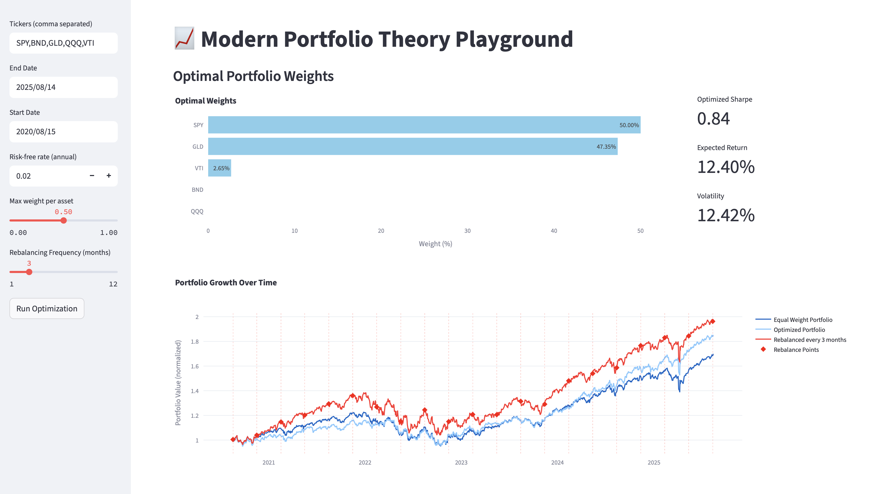

# 📈 Modern Portfolio Theory Playground

A web-based interactive application to explore portfolio optimization using **Modern Portfolio Theory (MPT)**. Users can simulate optimized and equal-weight portfolios, visualize portfolio growth over time, and explore the effects of rebalancing strategies.  

  

---

## ✨ Features

- Compute **optimal portfolio weights** using Sharpe ratio optimization  
- Simulate portfolio growth with different weights  
- Compare **equal-weight, optimized, and rebalanced portfolios**  

---

## 🛠️ Technologies Used

- [Streamlit](https://streamlit.io/) - Web interface framework  
- [Plotly](https://plotly.com/python/) - Interactive charts and visualizations  
- [Yahoo Finance API (`yfinance`)](https://pypi.org/project/yfinance/) - Historical market data  
- [SciPy](https://www.scipy.org/) - Optimization routines for portfolio weights  

---

## 🚀 Installation

1. Clone this repository:  
```bash
git clone https://github.com/debdurbachatterjee/mpt_playground
cd mpt_playground
```

2. Install the required packages:
```bash
pip install -r requirements.txt
```

## 📖 Usage

1. Start the application:
```bash
streamlit run app.py
```

2. Open the provided local URL in your web browser (typically http://127.0.0.1:8501)

3. Use the application:
- Sidebar Inputs: Enter tickers, select start/end dates, define risk-free rate, maximum weights, and rebalancing frequency.
- Run Optimization: Click the button to calculate optimal portfolio weights and metrics.
- Portfolio Visualization: Inspect bar charts of optimal weights and portfolio growth over time with markers showing rebalancing events.